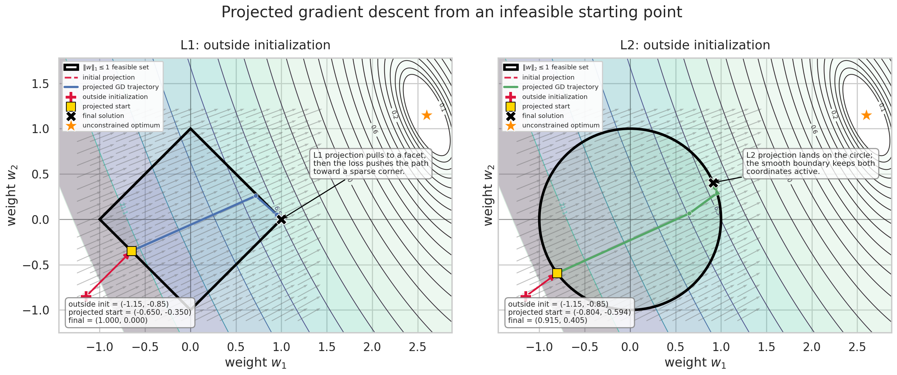

# L1 vs L2 Constraint Visualization

Visualize projected gradient descent under L1 & L2 norm constraints.
It compares how optimization behaves when the feasible region is an L1 diamond versus an L2 circle.

## Overview

Simulation uses a 2D quadratic loss function with an unconstrained optimum outside the feasible region. Starting from an infeasible initial point, the algorithm first projects the point onto the constraint set, then runs projected gradient descent.

Geometric difference between the two constraints -

- *L1 constraint* creates diamond-shaped feasible region and encourages sparse solutions.
- *L2 constraint* creates circular feasible region and tends to shrink weights smoothly while keeping coordinates active.

## What the script does

1. Defines a quadratic loss function.
2. Defines L1 and L2 projection operators.
3. Starts from a point outside the feasible set.
4. Projects the point onto the constraint region.
5. Runs projected gradient descent.
6. Plots the optimization trajectories over loss contours.

## Quick concept

### L1 constraint

The L1 feasible set is:

`||w||_1 <= 1`

In 2D, this forms a diamond. Because the diamond has sharp corners, the optimizer may land on a sparse solution where one coordinate becomes zero (KKT wins).

### L2 constraint

The L2 feasible set is:

`||w||_2 <= 1`

In 2D, this forms a circle. The smooth boundary usually leads to solutions where both coordinates remain active.

### NOTE
This is intended as a visual and educational simulation, not a general-purpose optimizer. The setup is chosen so that the geometric effects of L1 and L2 constraints are easy to see.
